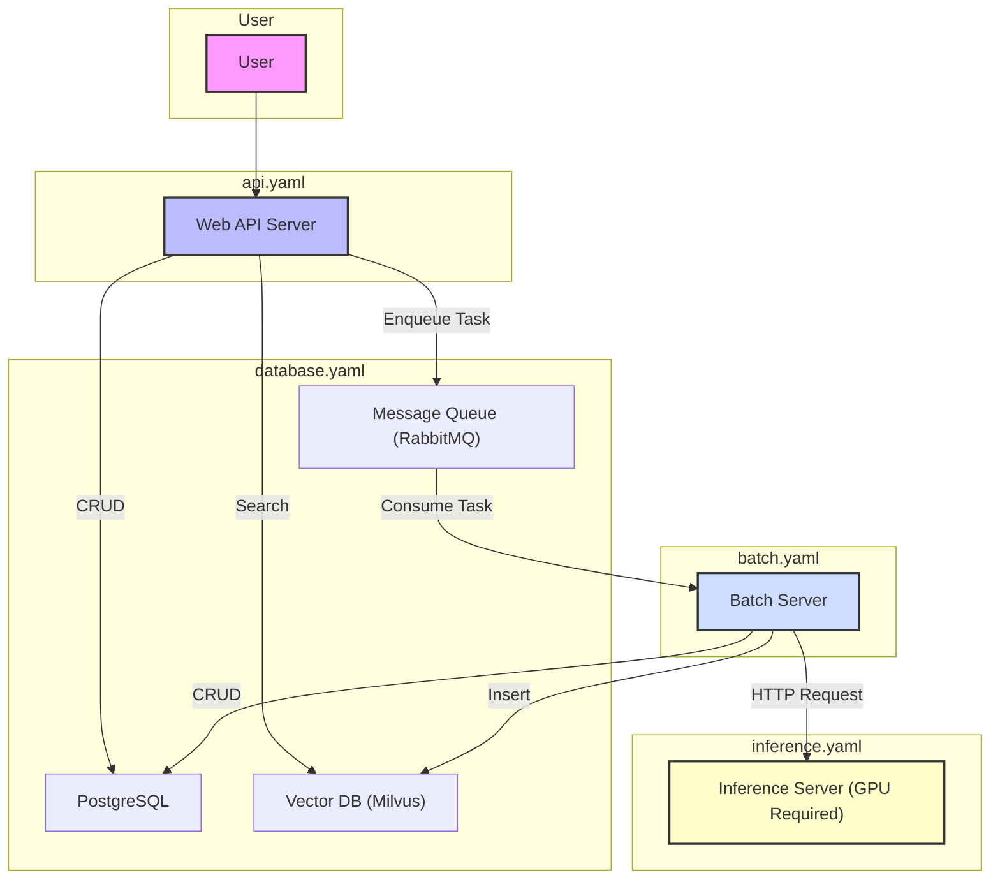

# Lainbow

Lainbow is a music analysis engine designed to process local music libraries. It offers batch processing capabilities to extract deep learning embeddings (MERT, CLAP) and various acoustic features from audio files. These features are then stored in a vector database to power an API for tasks like similarity-based music recommendations and natural language search.

The project is primarily intended for integration with the MPD client, [Sola MPD](https://github.com/prokosna/sola_mpd).

## Architecture Overview

Lainbow is built on a microservices architecture, with each component containerized using Docker. The system consists of four main services that work together:

- **Web API Server**: The main entry point for user requests. It handles API calls, interacts with the databases, and delegates heavy tasks to the batch server.
- **Inference Server**: A dedicated service that hosts the deep learning models (MERT and CLAP) and performs inference tasks (e.g., generating embeddings from audio or text).
- **Batch Server**: A Celery-based worker that processes long-running, asynchronous tasks, such as scanning the music library and analyzing songs.
- **Databases**: A set of databases for storing metadata, vector embeddings, and managing task queues:
    - **PostgreSQL**: Stores song metadata, features, and task information.
    - **Milvus**: A vector database for storing and searching high-dimensional embeddings.
    - **RabbitMQ**: A message broker that facilitates communication between the Web API and the Batch Server.



## Model Preparation

**Before running the application, you need to download the required deep learning models (MERT and CLAP).**

1.  **Install Dependencies**:
    First, ensure you have the necessary Python packages installed:
    ```bash
    pip install -r requirements.txt
    ```

2.  **Download Models**:
    Run the provided script to download and place the models in the `./models` directory. The script will skip any models that are already downloaded.
    ```bash
    python download_models.py
    ```

This script will download:
- The MERT model (`m-a-p/MERT-v1-330M`) from Hugging Face Hub.
- The CLAP model checkpoint from `huggingface.co/lukewys/laion_clap`.

Once the script completes, the application will be ready to run.

## Setup and Configuration

### Application Customization
Customize the application by editing the `.env` file. The default settings should work out-of-the-box if you are running all components on a single machine with no port conflicts. However, **you must at least set the path to your music library**.

### GPU Configuration for Inference Server
The `docker/inference.Dockerfile` uses a specific PyTorch base image optimized for the author's GPU (RTX 5070 Ti). **You may need to modify the `FROM` instruction in this Dockerfile** to use a base image compatible with your GPU hardware.

Additionally, **ensure that the [NVIDIA Container Toolkit](https://docs.nvidia.com/datacenter/cloud-native/container-toolkit/latest/install-guide.html) is properly installed and configured**. This is required for Docker to access and utilize the GPU.

### Starting the Application

Start the services on your server(s). You can run each service on a separate server or on the same machine. **Ensure that the `.env` file on each server is configured correctly** to allow communication between the services.

**Database Server**
```bash
docker compose -f docker-compose.database.yaml up -d
```

**Web API Server**
```bash
docker compose -f docker-compose.api.yaml up -d
```

**Inference API Server**
```bash
docker compose -f docker-compose.inference.yaml up -d
```

**Batch Server**
```bash
docker compose -f docker-compose.batch.yaml up -d --scale batch-cpu=N
```
*(Note: `N` is the number of parallel processes. A value of around 6 is recommended.)*

## API Endpoints

| Method | Path                               | Summary                                |
|--------|------------------------------------|----------------------------------------|
| `GET`  | `/health`                          | Health check                           |
| `GET`  | `/api/v1/stats`                    | Get database statistics                |
| `POST` | `/api/v1/batch/scan/run`           | Start a music library scan             |
| `POST` | `/api/v1/batch/vacuum/run`         | Run library vacuum                     |
| `POST` | `/api/v1/batch/analyze/run`        | Run song analysis                      |
| `GET`  | `/api/v1/batch/tasks/{task_id}`    | Get task status                        |
| `GET`  | `/api/v1/songs/search`             | Search songs by natural language       |
| `GET`  | `/api/v1/songs/{file_path}/analysis` | Get detailed song analysis             |
| `GET`  | `/api/v1/songs/{file_path}/similar`  | Find similar songs                     |
